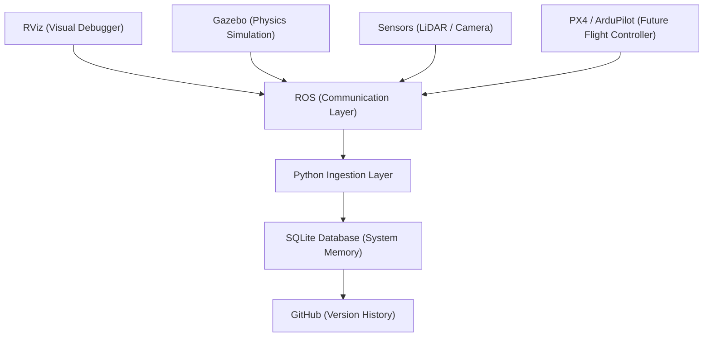

## Shadow Robotics Architecture

```mermaid
flowchart TD

RViz["RViz (Visual Debugger)"]

ROS["ROS (Communication Layer)"]

Gazebo["Gazebo (Physics Simulation)"]
Sensors["Sensors (LiDAR / Camera)"]
PX4["PX4 / ArduPilot (Future Flight Controller)"]

Python["Python Ingestion Layer"]
SQLite["SQLite Database (System Memory)"]
GitHub["GitHub (Version History)"]

RViz --> ROS

Gazebo --> ROS
Sensors --> ROS
PX4 --> ROS

ROS --> Python
Python --> SQLite
SQLite --> GitHub
```
